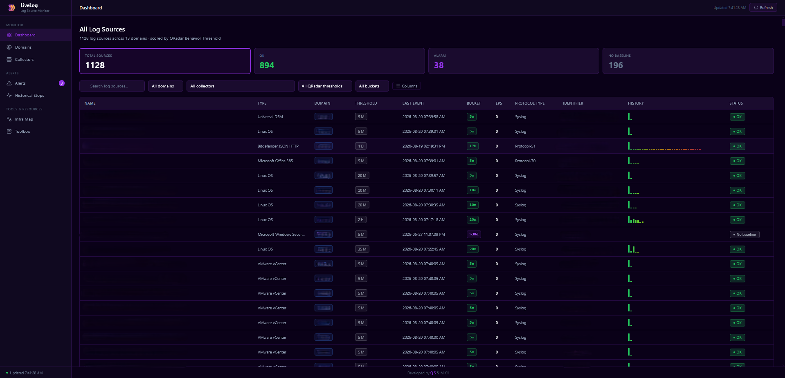
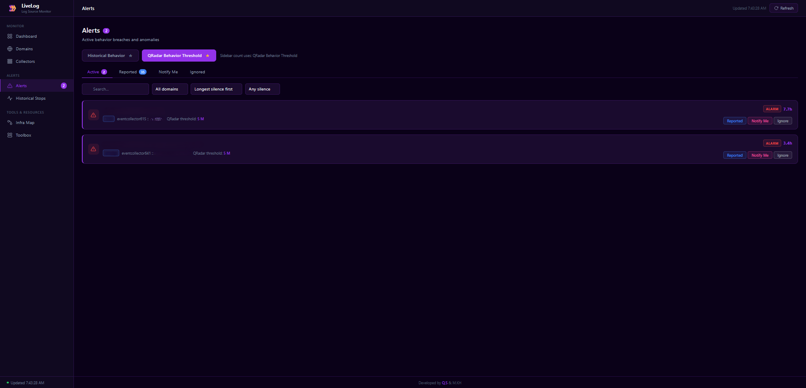
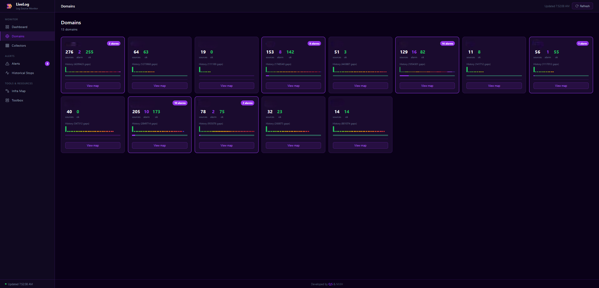
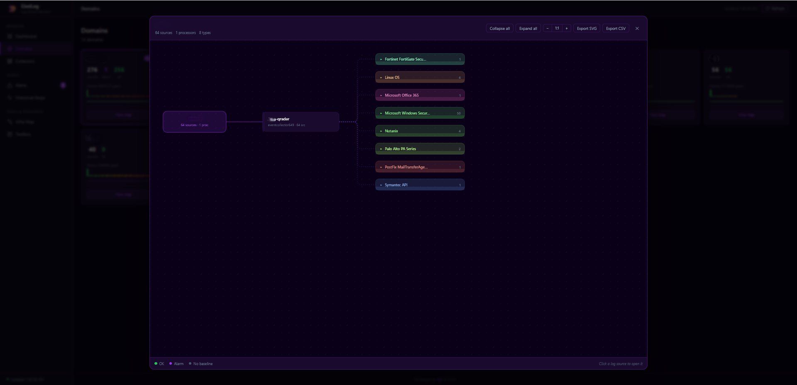
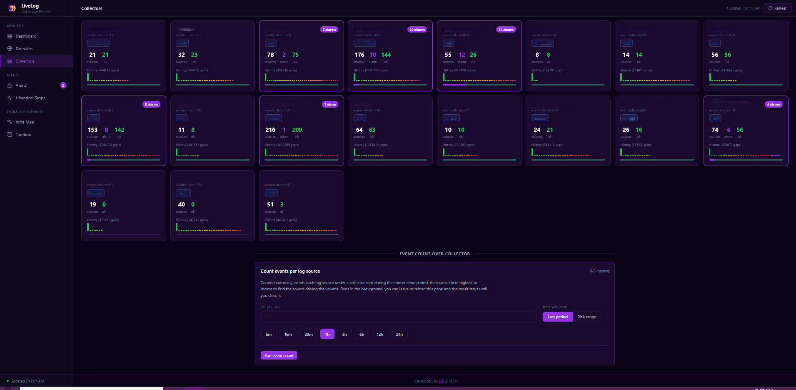
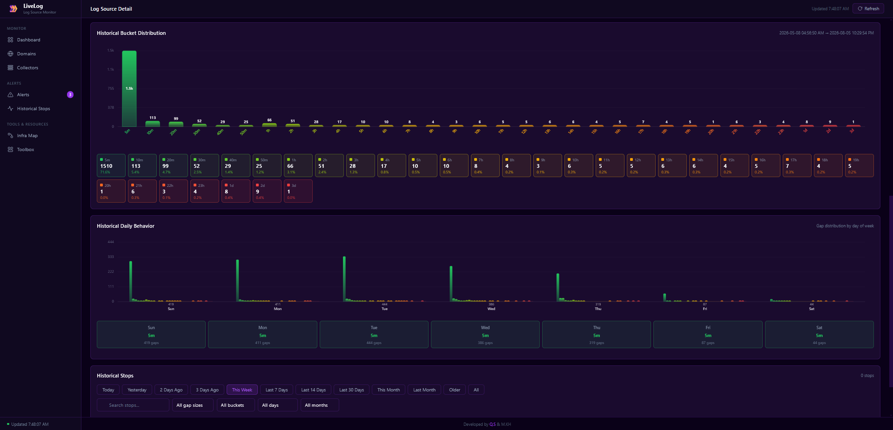
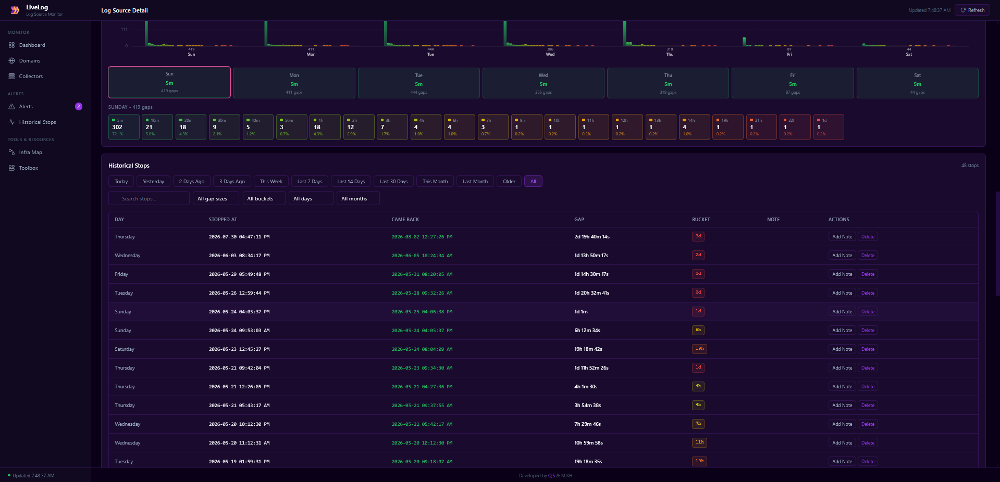
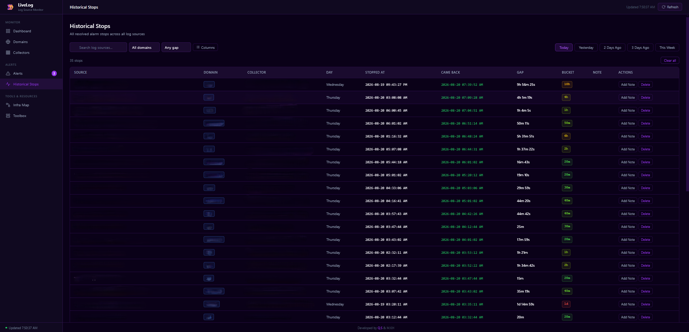
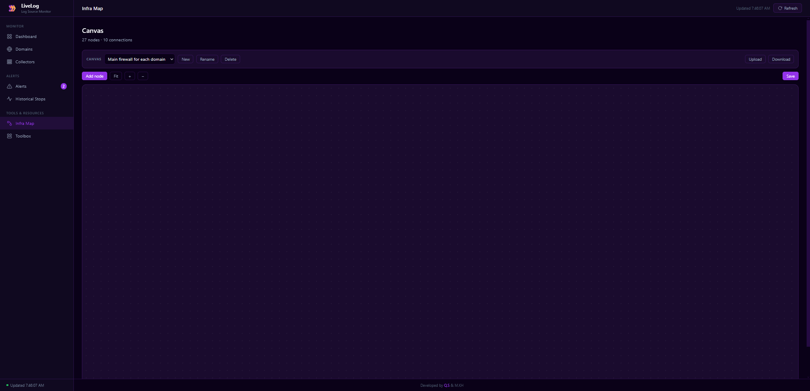
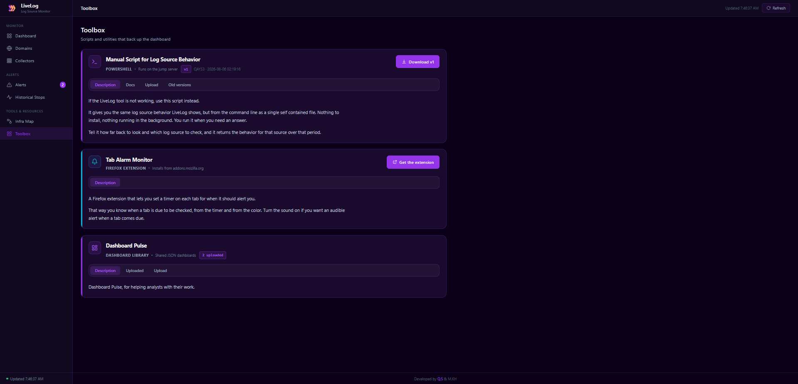

<div align="center">


# LiveLog

**QRadar Log Source Monitor**

Live behavior monitoring, silence-gap analytics, and outage history for every log source in QRadar.

[](https://learn.microsoft.com/powershell/)
[](https://www.ibm.com/qradar)
[](https://developer.mozilla.org/docs/Web/JavaScript)
[](#running)


</div>

---

## Table of Contents

- [Overview](#overview)
- [Screenshots](#screenshots)
- [Architecture](#architecture)
- [Project Structure](#project-structure)
- [Configuration](#configuration)
- [HTTP API](#http-api)
- [Data Schemas](#data-schemas)
- [Features](#features)
- [Key Decisions](#key-decisions)
- [Running](#running)

---

## Overview

A PowerShell backend polls every enabled log source from QRadar on a fixed interval, resolves the true last-event time through an Ariel delta query, calculates silence gap buckets, and writes the result as flat JSON grouped by domain and collector. A vanilla JavaScript single-page application reads those files and renders everything live. The same PowerShell process also serves the HTTP backend, so there is no web server, no database, and no runtime dependency to install.

| | |
|---|---|
| **Backend** | Windows PowerShell 5.1, `System.Net.HttpListener`, background runspaces |
| **Frontend** | Vanilla JavaScript, hash routing, canvas-rendered charts, no build step |
| **Data source** | QRadar REST API and Ariel AQL searches |
| **Persistence** | Flat JSON on disk, atomic temp-file and move writes |
| **Deployment** | Single directory on a jump server, launched with one command |

---

## Screenshots

### Dashboard

Every monitored log source with behavior, current bucket, last event time, domain, collector, protocol, identifier, and status. Stat cards double as filters.



### Alerts

Sources that fell outside their normal behavior, scored live in the browser. Engine switch selects between Historical Behavior and QRadar Behavior Threshold; tabs separate Active, Reported, Notify Me, and Ignored.



### Domains

One card per domain with source counts, alarm counts, and an aggregate gap history strip. Each card opens a domain map.



### Domain Map

Hierarchical view of a domain: domain to collector to log source type to source. Collapsible groups, zoom controls, SVG and CSV export.



### Collectors

One card per event collector, with the per-collector event count tool mounted underneath for finding the source driving ingestion volume.



### Log Source Behavior

Historical bucket distribution, per-day gap behavior with drill-down, and the full stop history for a single source.





### Historical Stops

Every resolved stop across all sources, with range tabs, gap-size and bucket filters, column picker, sortable headers, per-stop notes, and delete.



### Infra Map

Editor for Obsidian-format `.canvas` infrastructure diagrams stored server-side. Multiple named canvases, pan, zoom, marquee select, drag, resize, recolor, connections, undo and redo, upload and download.



### Toolbox

Versioned scripts and utilities that back up the dashboard, with upload, download, release notes, and a shared dashboard library.



---

## Architecture

```
main.ps1
    |
    |-- Polling Loop (every interval_sec)
    |       GET /api/log_sources          QRadar LSM, includes last_event_time fallback
    |       GET /api/collectors           QRadar
    |       GET /api/groups               QRadar
    |       GET /api/types                QRadar
    |       AQL last-event delta query    Ariel, START/STOP window since previous poll
    |       merge Ariel result into the cumulative last-event map, LSM as fallback
    |       GET /api/log_sources/{id}     QRadar, cached, protocol_type and identifier
    |       calculate gap buckets
    |       apply the downtime guard
    |       record stops to data/stops.json
    |       write data/domains/{domain}/{collector}.json
    |       write data/state.json and data/poll-heartbeat.json
    |
    |-- HTTP Listener (0.0.0.0:9393)
    |       static files, JSON API, background job endpoints
    |
    |-- Background Runspaces
            analysis jobs   up to 3 concurrent Ariel behavior analyses
            EPS jobs        up to 3 concurrent per-collector event counts
```

The listener never blocks on QRadar. Long-running work is dispatched to its own STA runspace and polled by the browser, so navigating away or reloading the page does not cancel it.

---

## Project Structure

```
LiveLog/
├── config.cfg
├── main.ps1
├── README.md
├── api/
│   ├── Get-LogSources.ps1
│   ├── Get-EventCollectors.ps1
│   ├── Get-LogSourceGroups.ps1
│   ├── Get-LogSourceTypes.ps1
│   ├── Get-LogSourceDetails.ps1
│   ├── Get-LastEvents.ps1
│   ├── Write-DomainJson.ps1
│   ├── Invoke-SourceAnalysis.ps1
│   ├── Invoke-AnalysisJobs.ps1
│   ├── Invoke-EpsTest.ps1
│   ├── Invoke-EpsJobs.ps1
│   ├── Invoke-CanvasStore.ps1
│   ├── Invoke-MapStore.ps1
│   ├── Invoke-DashboardStore.ps1
│   ├── Invoke-ToolStore.ps1
│   └── Start-HttpListener.ps1
├── assets/
│   ├── css/
│   │   ├── root.css
│   │   ├── main.css
│   │   ├── dashboard.css
│   │   ├── alerts.css
│   │   ├── domain-map.css
│   │   └── toolbox.css
│   ├── docs/
│   │   ├── dashboard.png
│   │   ├── alerts.png
│   │   ├── domains.png
│   │   ├── domain-map.png
│   │   ├── collectors.png
│   │   ├── historical-stops.png
│   │   ├── infra.png
│   │   ├── toolbox.png
│   │   ├── log-source-behavior-1.png
│   │   └── log-source-behavior-2.png
│   ├── img/
│   │   └── logo.png
│   └── js/
│       ├── app.js
│       ├── buckets.js
│       ├── charts.js
│       ├── labels.js
│       ├── poller.js
│       ├── dashboard.js
│       ├── domains.js
│       ├── domain-map.js
│       ├── collectors.js
│       ├── logsource.js
│       ├── alerts.js
│       ├── historical-stops.js
│       ├── source-analysis.js
│       ├── eps-test.js
│       ├── canvas-editor.js
│       ├── stop-note-modal.js
│       └── toolbox.js
├── canvas/
│   └── {canvas-name}.canvas
├── map/
│   └── {domain}.json
├── Tools/
│   ├── {tool-id}/
│   │   ├── meta.json
│   │   └── versions/
│   └── dashboard-pulse/
│       ├── _manifest.json
│       └── {dashboard}.json
├── data/
│   ├── labels.json
│   ├── overrides.json
│   ├── stops.json
│   ├── alert-status.json
│   ├── state.json
│   ├── poll-heartbeat.json
│   └── domains/
│       └── {domain}/
│           └── {collector}.json
├── log/
│   └── livelog.log
└── templates/
    └── index.html
```

---

## Configuration

All runtime behavior is driven by `config.cfg` in the project root.

```ini
[qradar]
host         = HOST
token        = TOKEN
verify_ssl   = false

[server]
port         = 9393
host         = 0.0.0.0
app_name     = LiveLog

[polling]
interval_sec = 30

[output]
data_dir     = ./data
domains_dir  = ./data/domains

[locale]
timezone     = Your Local Timezone

[alerts]
behavior_breach      = true
eps_drop             = true
undefined_behavior   = true
buffer_minutes       = 3
max_bucket_min_count = 4
min_alert_minutes    = 5

[downtime]
enabled                 = true
grace_minutes           = 10
mass_gap_min_sources    = 5
mass_gap_min_collectors = 2
mass_gap_window_min     = 15

[domains]
list = Domain1, Domain2, Domain3

[ignore_groups]
list = GroupToIgnore

[ignore_types]
list = SIM Generic Log DSM

[ignore_collectors]
list =

[ignore_source_ids]
list =

[ignore_name_patterns]
list =

[collector_domains]
eventcollectorXXX :: CollectorName = DomainName
```

### Settings reference

| Key | Section | Purpose |
|---|---|---|
| `host` | `qradar` | QRadar console address, without scheme |
| `token` | `qradar` | Authorized service token, sent as the `SEC` header |
| `verify_ssl` | `qradar` | Set `false` to accept a self-signed console certificate |
| `interval_sec` | `polling` | Seconds between poll cycles |
| `port` / `host` | `server` | Listener bind address |
| `app_name` | `server` | Title shown in the sidebar, page title, and tab |
| `timezone` | `locale` | Windows timezone id used for all displayed timestamps |
| `buffer_minutes` | `alerts` | Absorbs poll lag before a silence becomes an alarm |
| `max_bucket_min_count` | `alerts` | How many times a bucket must occur to count as the baseline |
| `min_alert_minutes` | `alerts` | Floor applied to any computed alarm threshold |
| `enabled` | `downtime` | Master switch for the downtime guard |
| `grace_minutes` | `downtime` | Heartbeat age that arms the guard on start or mid-run |
| `mass_gap_*` | `downtime` | Thresholds for detecting a platform-level outage |
| `list` | `ignore_*` | Exclusion filters applied before anything is written |
| `collector_domains` | `collector_domains` | Maps each collector to the domain it belongs to |

**Authentication.** If `token` is set under `[qradar]`, the tool authenticates with that authorized service token and ignores username and password. If `token` is empty, it falls back to `username` and `password` sent as HTTP Basic. A token is recommended: it avoids storing a password in the config and can be scoped and revoked in QRadar.

---

## HTTP API

| Method | Route | Purpose |
|---|---|---|
| `GET` | `/` | `index.html` |
| `GET` | `/api/config` | App name, alert buffer, bucket and alert minimums |
| `GET` | `/api/state` | `state.json`, distinct source total |
| `GET` | `/api/domain-files` | Paths of every collector JSON file |
| `GET` | `/api/labels` | `labels.json` |
| `PUT` | `/api/labels/{id}` | Set a custom label on a source |
| `GET` | `/api/overrides` | `overrides.json` |
| `PUT` | `/api/overrides/{id}` | Set a manual alert threshold in milliseconds |
| `DELETE` | `/api/overrides/{id}` | Remove a manual alert threshold |
| `GET` | `/api/alerts` | Server-side alert view |
| `GET` | `/api/alert-status` | `alert-status.json` |
| `PUT` | `/api/alert-status/{id}` | Set alert status for a source |
| `DELETE` | `/api/alert-status/{id}` | Clear alert status for a source |
| `GET` | `/api/stops/{id}` | Historical stops for one source |
| `PUT` | `/api/stops/{id}/{idx}/note` | Add or edit a note on a stop entry |
| `DELETE` | `/api/stops/{id}/{idx}` | Delete one stop entry |
| `POST` | `/api/stops/bulk-delete` | Delete a batch of stop entries |
| `GET` | `/api/logsource-detail/{id}` | Live detail pulled from QRadar for one source |
| `GET` | `/api/analysis-jobs` | List background analysis jobs |
| `POST` | `/api/analysis-jobs` | Start an analysis job, `429` when three are running |
| `GET` | `/api/analysis-jobs/{id}` | Poll one job, includes the result when done |
| `DELETE` | `/api/analysis-jobs/{id}` | Dismiss a job and free its slot |
| `POST` | `/api/source-analysis/{id}` | Synchronous analysis, retained for compatibility |
| `POST` | `/api/source-analysis/{id}/overwrite` | Commit an analysis result to disk |
| `POST` | `/api/reset-buckets/{id}` | Clear stored history for one source |
| `GET` | `/api/eps-jobs` | List background EPS jobs |
| `POST` | `/api/eps-jobs` | Start a per-collector event count job |
| `GET` | `/api/eps-jobs/{id}` | Poll one EPS job |
| `DELETE` | `/api/eps-jobs/{id}` | Dismiss an EPS job |
| `GET` | `/api/canvas/list` | Every saved canvas with node and edge counts |
| `GET` | `/api/canvas?name=` | Read one canvas |
| `PUT` | `/api/canvas?name=` | Write one canvas |
| `DELETE` | `/api/canvas?name=` | Delete one canvas |
| `POST` | `/api/canvas/rename` | Rename a canvas |
| `GET` | `/api/dashboards` | Shared dashboard manifest |
| `POST` | `/api/dashboards` | Upload a dashboard JSON |
| `GET` | `/api/dashboards/file/{name}` | Download a dashboard JSON |
| `DELETE` | `/api/dashboards/{name}` | Delete a dashboard JSON |
| `GET` | `/api/tools/{tool}/versions` | Version history for a tool |
| `POST` | `/api/tools/{tool}/versions` | Publish a new tool version |
| `GET` | `/api/tools/{tool}/download` | Download the current tool version |
| `DELETE` | `/api/tools/{tool}/versions/{id}` | Delete one tool version |
| `GET` | `/*` | Static files |

---

## Data Schemas

### Collector JSON

`data/domains/{domain}/{collector}.json`

```json
{
  "collector_name": "eventcollectorXXX :: CollectorName",
  "domain_group": "DomainName",
  "last_updated": "2026-05-28 01:00:00 AM",
  "log_sources": [
    {
      "id": 101,
      "name": "...",
      "log_source_type": "...",
      "domain_group": "...",
      "behavior_threshold": "5 M",
      "custom_label": null,
      "creation_date": "...",
      "last_event_time": "...",
      "last_event_ms": 1234567890000,
      "average_eps": 14,
      "current_bucket": "5m",
      "analyzed_from": null,
      "analyzed_to": null,
      "buckets": { "5m": 0, "10m": 0, "...": 0, ">30d": 0 },
      "daily_buckets": { "Sunday": {}, "...": {}, "Saturday": {} },
      "protocol_type": "Syslog",
      "identifier": "10.0.0.1"
    }
  ]
}
```

### stops.json

```json
{
  "101": [
    {
      "start_ms":   1748500000000,
      "end_ms":     1748507200000,
      "gap_ms":     7200000,
      "bucket":     "2h",
      "day":        "Friday",
      "started_at": "2026-05-29 01:00:00 AM",
      "ended_at":   "2026-05-29 03:00:00 AM",
      "note":       "Optional analyst note"
    }
  ]
}
```

Keyed by source id, capped at 1000 entries per source. A stop is recorded only when all of the following hold:

- the bucket is larger than `15m`, so `5m` and `10m` are never recorded
- that bucket has not already reached `max_bucket_min_count` entries for the source, so each level is kept up to that many times
- the bucket is not smaller than the source's established maximum; once any bucket reaches `max_bucket_min_count` it becomes the floor and smaller stops are skipped

Any residual `5m` stops are cleaned out on write. The same rule is applied by the live poll in `Write-DomainJson.ps1` and by New Analysis in `Invoke-SourceAnalysis.ps1`.

### overrides.json

```json
{
  "101": 1200000
}
```

Keyed by source id. The value is the manual alert threshold in milliseconds, bypassing the historical bucket algorithm entirely.

### alert-status.json

```json
{
  "101": {
    "status": "reported",
    "updated_at": 1748500000000
  },
  "202": {
    "status": "notify_after",
    "notify_after_ms": 1748510000000,
    "updated_at": 1748500000000
  }
}
```

Keyed by source id. Status values are `active`, `reported`, `notify_after`, and `ignored`. Entries are deleted automatically when the source recovers.

---

## Features

**Live log source view.** Every monitored source with its behavior, current bucket, last event time, domain, collector, protocol, identifier, and QRadar status, refreshed every poll. Replaces the manual go-back-30-days, export-CSV, run-a-script routine for a quick read.

**Alert system.** Sources are flagged the moment they fall outside their normal behavior, with tabs for Active, Reported, Notify Me, and Ignored. Severity is computed in the browser on every poll from `last_event_ms`; there is no warning state, only alarm, ok, and neutral.

**Historical Stops.** A searchable, sortable, filterable table of recorded stops across all sources, with per-stop notes and date-range filters. Stops are recorded by the live poll and by New Analysis under the same rule.

**New Analysis.** Runs an Ariel AQL search for any source over a chosen period in its own background runspace, up to three at a time, and returns event count, buckets, daily breakdown, and stops. Results persist in a floating tray and survive reloads and navigation.

**EPS test over collector.** Measures real events per second for every source under a chosen collector, over a preset window or a picked From and To range, then ranks them highest to lowest to find the source driving the load. Also runs in the background with a persistent tray.

**Domain Map.** Hierarchical SVG map of a domain down to individual log sources, colored by severity, with collapsible type groups, zoom controls, and SVG and CSV export.

**Infra Map.** Editor for Obsidian-format `.canvas` infrastructure maps stored on the server under `canvas/`. Multiple named canvases with New, Rename, and Delete; pan, zoom, marquee multi-select, drag, resize, text editing, recolor, node and connection editing, undo and redo, upload and download.

**Toolbox.** Versioned distribution point for the scripts that back up the dashboard, with release notes, download of the current version, old-version history, and a shared JSON dashboard library.

**QRadar status.** Each source shows why it is in its current state, using the status and status reason pulled from QRadar in bulk every poll.

---

## Key Decisions

### Filtering, what gets stored

- Only sources with `enabled = true` in QRadar
- Excludes `eventcollector0 :: QConsole`
- Excludes anything matching `ignore_groups`, `ignore_types`, `ignore_collectors`, `ignore_source_ids`, and `ignore_name_patterns`
- Excludes sources where `last_event_time = 0`, meaning they never sent events
- Excludes sources whose `last_event_time` is older than 60 days, unless the source already has bucket history on disk
- Disabled sources with bucket history are preserved and never deleted
- The ignore purge only runs when a poll returned at least 100 sources, protecting against a partial poll wiping data

### Bucket logic

- A gap is recorded when `newLastEventMs > prevLastEventMs`, meaning a new event arrived after silence
- `prevLastEventMs = 0` on the first poll, so no gap is recorded at cold start
- Buckets run `5m, 10m, 20m, 30m, 40m, 50m`, then `1h` through `23h`, then `1d` through `30d`, then `>30d`
- The bucket is assigned with `Floor(gap_ms / 60000)` to avoid floating-point overflow
- Daily buckets track the same gaps by day of week

### Downtime guard

The guard exists so that the monitor's own downtime is never written into a source's history as a fake outage.

- The poll loop writes `data/poll-heartbeat.json` after every cycle that successfully wrote data
- On start the tool compares that heartbeat to the current time. If the gap exceeds `grace_minutes`, the guard arms and logs a warning
- While armed, any gap whose baseline `last_event_ms` on disk predates the restart is dropped: not counted in `buckets`, not counted in `daily_buckets`, and not written to `stops.json`
- Suppression clears itself per source. As soon as a source reports one event after the restart its baseline is current again and the next gap is recorded normally. There is no cycle counting and no timer, so a source that fires once a day is still handled correctly
- The same window arms mid-run whenever more than `grace_minutes` passes between two successful cycles, covering a sleeping host, an unreachable console, or a network outage
- A second independent rule: if at least `mass_gap_min_sources` sources spread over at least `mass_gap_min_collectors` collectors all went abnormally silent starting inside the same `mass_gap_window_min` window, that is treated as a platform-level outage and those gaps are dropped as well. Only silences already past a source's own alarm threshold are counted, so idle sources never trigger it
- `last_event_time`, `last_event_ms`, and `current_bucket` are still updated for suppressed sources, so the live view and the alerts page stay accurate. Only the history is protected
- Gaps are collected during the poll pass and committed after it, so a whole cycle is judged at once rather than one source at a time
- Every skipped cycle is summarized in `log/livelog.log`, for example `Downtime guard: skipped 214 of 219 gaps this cycle across 13 collector(s) [214 x poller downtime]`
- Set `enabled = false` under `[downtime]` to record everything unconditionally

### Alert algorithm

Severity is computed live in the browser on every poll. There is no `alerts.json`.

- `maxBucket` is the highest bucket whose count is at least `max_bucket_min_count`, representing the worst recurring stop; if none reach it, the highest bucket with any count is used
- `maxThreshold` is that bucket's value in minutes, floored at `min_alert_minutes`
- `diffMin = (Date.now() - last_event_ms) / 60000`
- `diffMin <= maxThreshold + buffer_minutes` is ok, anything greater is an alarm
- Sources with no bucket history and no manual override never appear in alerts
- `buffer_minutes` absorbs poll lag, default 3
- `max_bucket_min_count` sets how many times a bucket must occur to count as the baseline, default 4

### Alert engine switch

- The Historical Behavior and QRadar Behavior Threshold switch appears on both the alerts page and the dashboard, and both drive one shared selection: flipping it on either page flips it everywhere
- The selected engine feeds `getEffectiveSeverity()`, so dashboard stat cards, the Status column, the bucket pill, and the domain and collector cards are all scored the same way as the alerts list
- A source the selected engine cannot score counts as No Baseline rather than being folded into OK. Under Historical that means no bucket history and no manual override; under QRadar it means no parseable `behavior_threshold`. Total equals OK plus Alarm plus No Baseline
- The star pins the engine used for the sidebar badge, independently of what is currently being viewed

### Alert status system

- Per-source statuses are Active, Reported, Notify Me, and Ignored
- Stored in `data/alert-status.json` and served over the API
- Notify Me snoozes for a chosen duration, with presets and a custom d/h/m/s input, then returns to Active when it expires
- Ignored is hidden from every tab except Ignored
- Status is deleted automatically when the source recovers

### Manual alert threshold

- Set per source in d/h/m/s on the log source detail page
- Stored in `data/overrides.json` in milliseconds
- Bypasses the bucket algorithm entirely; the alarm fires when silence exceeds the override
- Tagged with a Manual badge on the alerts page
- Cleared by setting every field to zero

### On-demand source analysis

- The New Analysis control on the log source detail page is mounted by `source-analysis.js`
- It pulls all events for one source over a chosen period of 24h, 7d, 14d, 30d, 60d, or 90d through an Ariel AQL search run server-side by `Invoke-SourceAnalysis.ps1`
- The AQL filters out events whose name contains `Device Stopped Emitting Events`, dedupes by timestamp using `devicetime` with `starttime` as fallback, and recomputes buckets, daily behavior, and stops
- Each analysis runs as a background job managed by `Invoke-AnalysisJobs.ps1`. Starting one posts to `/api/analysis-jobs`, which spins up its own STA runspace and returns immediately, so the listener never blocks
- Concurrency is capped at three. A fourth start returns HTTP 429 until a slot frees; the period buttons disable and a message shows while all slots are busy
- Jobs live in memory only. The job manager never reads, writes, or deletes anything under the data path; committing to disk stays the job of the overwrite endpoint
- Job state is held server-side, so reloading or leaving the page keeps the analysis running. A floating tray lists every job as running, done, or failed, with View and dismiss controls, and returning to the source re-attaches to the result
- The result stays visible until closed, which calls `DELETE /api/analysis-jobs/{id}` to free the slot
- Overwrite commits the result: it writes `buckets`, `daily_buckets`, `analyzed_from`, `analyzed_to`, and `current_bucket` into the source's collector JSON and replaces that source's entries in `stops.json`, both through atomic temp-file and move
- After an overwrite the poll loop continues appending new gaps on top of the analyzed history, since it reads the file as its baseline each cycle, so backfill and live monitoring coexist
- `analyzed_from` and `analyzed_to` record the window the history was backfilled from
- Useful for seeding history on first deploy, or re-seeding a source whose history was cleared or needs a longer baseline

Reference query:

```sql
SELECT DATEFORMAT(devicetime,'YYYY-MM-dd HH:mm:ss') AS event_time,
       devicetime AS dev_ms,
       starttime  AS start_ms,
       QIDNAME(qid) AS event_name
FROM events
WHERE logsourceid=ID
  AND QIDNAME(qid) NOT ILIKE '%Device Stopped Emitting Events%'
ORDER BY devicetime ASC
LAST 7 DAYS
```

### Analysis stop detection

- Walks gaps in time order and records a stop only when a gap's bucket is higher than the highest bucket already recorded as a stop
- Once a level is recorded, later gaps at or below it are skipped, so each bucket level appears at most once, the first time it occurred
- The baseline starts at `5m`, so routine short gaps and cold starts never count as stops
- The result is a concise escalation log rather than one row per outage
- `max_bucket` for the analysis is still computed with the `max_bucket_min_count` rule

### Normal Stop and Max Stop

- Normal Stop is the mode, the highest-count bucket, where gaps usually land, clamped so it can never exceed Max Stop
- Max Stop is `maxBucket`, the highest bucket reaching `max_bucket_min_count`
- Earlier builds derived Normal from the largest positional gap in the histogram, which could invert and produce a Normal above Max; the mode-based value fixes that

### Last-event resolution

- The LSM `last_event_time` field from `GET /api/log_sources` updates on its own schedule and can lag well behind real ingestion
- Each poll runs `SELECT logsourceid, MAX(starttime) AS last_ms FROM events GROUP BY logsourceid`, scoped with `START` and `STOP` to the window since the previous poll, with a small overlap to avoid boundary gaps
- Results merge into a persistent in-memory map. A source's value updates only when it appears in a delta window with a newer timestamp, otherwise it holds its last known value indefinitely
- A source that fires once a day keeps its correct timestamp between appearances instead of reverting to a stale value
- The `last_event_time` written to the domain JSON is the maximum of the Ariel value and the LSM value, so LSM only wins for a source that has not appeared in Ariel yet
- The Ariel query itself takes seconds. A source not updating means QRadar has not indexed the event yet, or the source genuinely has not fired, not that the query is slow

### Protocol type and identifier

- Fetched from QRadar per source and cached permanently in the collector JSON
- Only fetched for sources missing the field, so the first deploy is slow and every run after it is fast

### Source deduplication

- The frontend deduplicates by source id using a `seenIds` set
- `state.json` counts distinct source ids across all collector files. An earlier build summed per-file counts, so a source present in two files was counted twice and the dashboard total drifted upward
- A source that changes domain or collector is written to its new file, and the stale copy in the old file is dropped rather than preserved. Any duplicate still on disk is logged as a warning and counted once
- The Total Sources card shows what is actually loaded and listed in the table. If the server reports a different number, hovering the card shows both

### Column preferences

- Persisted in `localStorage`
- Default columns are Name, Type, Collector, QRadar Behavior Threshold, Last Event, Bucket, EPS, and Status
- Optional columns are Domain, Protocol Type, and Identifier

### Routing

- Hash-based single-page routing: `#/dashboard`, `#/domains/{name}`, `#/collectors/{name}`, `#/logsource/{id}`, `#/alerts`, `#/historical-stops`, `#/infra`, `#/toolbox`
- The application name comes from `app_name` under `[server]` in `config.cfg`

---

## Running

```powershell
.\main.ps1
```

Then open `http://localhost:9393`.

### Running in the background

```powershell
Start-Process powershell -ArgumentList "-NoProfile -WindowStyle Hidden -File `"$PWD\main.ps1`"" -WorkingDirectory $PWD
```

### Stopping

```powershell
Get-CimInstance Win32_Process -Filter "CommandLine LIKE '%main.ps1%'" |
    ForEach-Object { Stop-Process -Id $_.ProcessId -Force }
```

---

<div align="center">

Developed by **Q.S** and **M.KH**

</div>